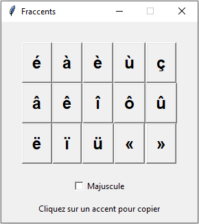

# Fraccents

A simple app that you can use to copy French accents. Great for language learners.

Une appli simple que vous pouver utiliser pour copier les accents français. Bons pour les apprenants de langue étrangère.

### How to Use / Comment utiliser

Click on an accented letter to copy. Paste it wherever you want!
Cliquez sur une lettre accentuée pour copier. Le coller où que vous voulez!

To copy a capital accented letter, click the checkbox that says "Majuscule"
Pour copier une lettre accentuée majuscule, cliquez la case à cocher qui dit « Majuscule »

### Screenshot / Capture d'Écran

### How to Install / Comment Installer

If you are on Windows, download this [EXE file](https://github.com/codezinx/fraccents/releases/download/binaries/fraccents.exe) and run it.
Si vous avez sur Windows, téléchargez ce [fichier d'EXE](https://github.com/codezinx/fraccents/releases/download/binaries/fraccents.exe) et l'exécutez.

1. First, install [Python](https://python.org). On Windows, make sure python.exe is added to PATH. / Premièrement, installer [Python](https://python.org). Sur Windows, s'assurer que python.exe est ajouté à « PATH ».
2. Then, download the code by clicking Code > Download ZIP / Puis, téléchargez le code par cliquant Code > Download ZIP
3. Unzip the file. / Dézipper le fichier.
4. Open a terminal and navigate to the directory of the program. / Ouvrir un terminal et naviger au répertoire du programme.
5. Next, type / Après, tapez `pip install -r requirements.txt` or/ou `pip3 install -r requirements.txt`
6. Run the program by clicking on "fraccents.py" / Exécutez un programme par cliquant sur « fraccents.py »

If you have a Mac or a Linux PC, please help contribute by making an installer for your OS.

Si vous avez un Mac ou un ordi de Linux, s.v.p. aidez contribuer par faisant un programme d'installation pour votre système d'exploitation.

### About Me

I'm a person who is still in the process of learning programming.
I am not that great at french! I use [WordReference](https://www.wordreference.com) to help me with my vocabulary.

Je suis un gen qui est encore en train d'apprendre la programmation.
Je suis pas si bon à français! J'utilise [WordReference](https://www.wordreference.com) pour m'aider avec mon vocabulaire.

#### Attribution

Eiffel Tower Icon by Freepik from Flaticon.
L'îcone de la tour Eiffel par Freepik de Flaticon.

This program uses [pyperclip by asweigart](https://github.com/asweigart/pyperclip/).
Ce programme utilise [pyperclip par asweigart](https://github.com/asweigart/pyperclip/).

Some code adapted from [here](https://stackoverflow.com/questions/7674790/bundling-data-files-with-pyinstaller-onefile/13790741#13790741).
Quelques code adapté d'[ici](https://stackoverflow.com/questions/7674790/bundling-data-files-with-pyinstaller-onefile/13790741#13790741).
